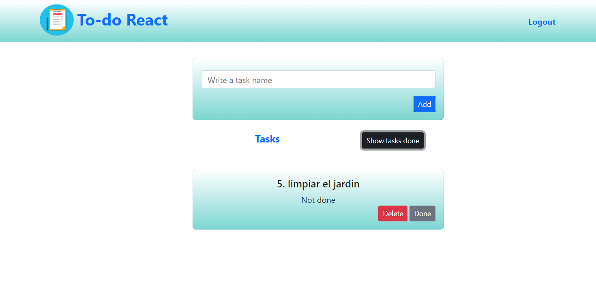

# To-do-app--supabase
CRUD de tareas con  supabase

**Preview**

##### INSTALACION
Ejecute `npm install` para descargar las dependencias de la aplicación.

Para este proyecto se utilizo

- [REACT VITE](https://vitejs.dev/guide/)
- [BOOTSTRAP](https://getbootstrap.com/docs/5.0/getting-started/introduction/)
- [SUPABASE V 1.7.7 ](https://app.supabase.com/)

### `npm run dev`

Ejecuta la aplicación en el modo de desarrollo.
Abra [http://localhost:5173](http://localhost:5173) para verlo en su navegador
